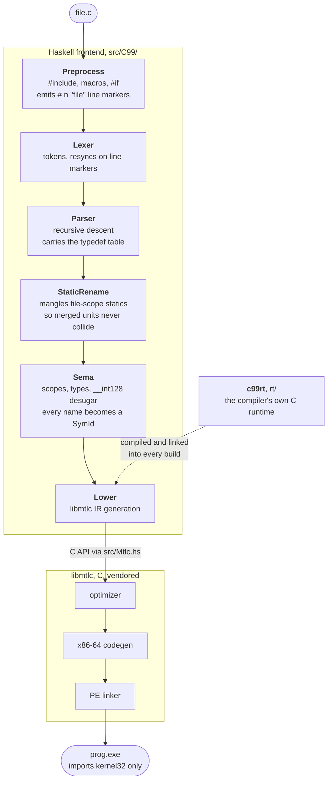
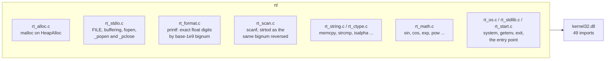
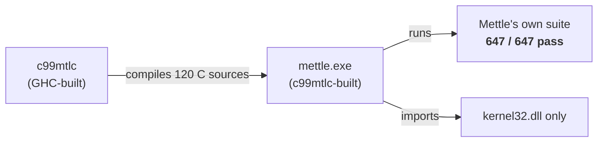
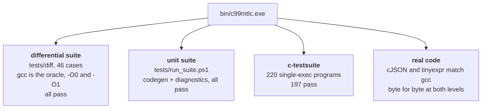
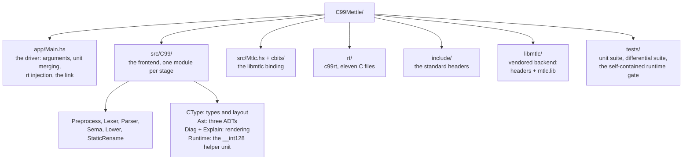

# C99Mettle

A C99 compiler for Windows x86-64, written in Haskell, backed by
[libmtlc](libmtlc/) (native IR, optimizer, object emitter, PE linker). It
preprocesses, parses, checks, and lowers C on its own, then hands libmtlc the
IR and gets back a finished executable. No gcc, no MSVC, no CRT: a program it
builds imports `kernel32.dll` and nothing else.

```bat
build.bat
bin\c99mtlc.exe tests\fib.c -o bin\fib.exe
powershell -File tests\run_suite.ps1
```

Building the compiler itself needs GHC (via
[GHCup](https://www.haskell.org/ghcup/)). Every dependency is a GHC boot
library, so `build.bat` runs `ghc --make` and needs no package index.
`c99mtlc.cabal` exists for `cabal build` if you prefer it.

## The pipeline

Each stage is one module, and each stage rebuilds the tree rather than
mutating it. Sema returns a program in which every expression carries a type
and every name resolves to a symbol id.



The driver (`app/Main.hs`) parses every translation unit before it gives up on
any of them, so one run reports everything that is wrong. Units merge into one
program before sema; `StaticRename` plus a per-output tag keep their statics
and string literals apart, in the merge and across separate `-c` compilations
alike.

## The runtime

c99rt is the C library, written in C99 and compiled by c99mtlc itself as part
of every build. There is no other libc anywhere in a finished program.



The driver injects these sources into every link. A name the program defines
itself wins over the runtime's definition, the way weak linkage would work in
a conventional toolchain. `--no-rt` turns the injection off for links that
bring their own libc.

## Proof it works

The strongest test is circular: c99mtlc compiles the Mettle compiler's 120 C
sources into a working `mettle.exe`, and that binary passes the Mettle
project's entire test suite.



Alongside the self-host loop:



Every file in `tests/diff/` reproduces a bug that was live once. The harness
compiles each case with gcc and with c99mtlc at both optimization levels and
compares what they print, so it catches a frontend bug (both levels disagree
with gcc) and a backend miscompile (the two levels disagree with each other).

## Usage

```
c99mtlc [options] <file.c>...

  -o <path>           output executable (default a.exe)
  -I <dir>            add an include search path
  -D <name>[=v]       predefine a macro (v defaults to 1)
  -U <name>           undefine a predefined macro
  -E                  preprocess only, to stdout
  -O0 / -O            optimization off / on
  -c                  emit an object file instead of linking
  --emit-ir           stop after lowering (smoke test)
  --no-rt             do not link c99rt
```

`include/` is on the search path by default and carries the standard headers,
all backed by c99rt.

Diagnostics follow the modern shape: a code, a snippet, a caret run, and a
suggestion when one exists.

```
error[E0102]: undeclared identifier 'coutner'
  --> hello.c:6:12
  |
5 | int main(void) {
6 |     return coutner + 1;
  |            ^^^^^^^ not found in this scope
7 | }
   = help: did you mean 'counter'?
```

`-Wno-<group>` silences a warning group, `-Werror` promotes the rest,
`--error-format=json` feeds editors, and `--explain <CODE>` tells you what a
code means and how to fix it. See [docs/diagnostics.md](docs/diagnostics.md).

## Layout



The AST is three data types: `Expr`, `Stmt`, `Decl`. Symbols are referenced by
id rather than by value because sema keeps changing them after the reference
exists; `&x` marks `x` address-taken long after the walker left `x`'s
declaration. `__int128` never reaches the backend: the parser desugars it into
a two-u64 struct, and any unit that mentions it pulls in one extra helper unit
(`src/C99/Runtime.hs`).

To update the backend, build [MettleToolchain](../MettleToolchain/) and run
`vendor-libmtlc.sh`, which copies the headers and `mtlc.lib` here, then
rebuild so `cbits` recompiles against the new headers.

## Corners it gets right

Points where a quick C implementation usually goes wrong, and this one does
not. Each has a differential test.

- Block-scope statics have static duration. `static int n;` in a function is
  a module-level global with a per-symbol link name, not stack storage, so it
  persists across calls.
- A static initializer may be any constant expression. `-1` is a negation of
  a literal, `1 << 10` is a shift; both reach the object instead of decaying
  to zero.
- A compound literal zeroes what its initializer does not mention, per C99
  6.7.8p21, even on a dirty stack frame.
- A string literal spelled in two branches works in both. The pointer behind
  it is materialized at function entry, the only point that dominates every
  use.
- Variably modified types carry their bounds at run time. `int a[n][m]` as a
  parameter or a local strides by `m * 4` bytes per row, `sizeof` answers
  from the evaluated bounds, and a bound is read once, where the declaration
  is.
- A member of a struct nobody owns is reachable: `f().a` and
  `(c ? s : t).a` work, per C99 6.5.2.3.
- Shifts promote each operand on its own and take the result type from the
  left one (C99 6.5.7p3), so an unsigned shift count cannot turn an
  arithmetic shift logical.
- Cast precedence follows C99 6.5.4: `(T)a < b` is `((T)a) < b`.
- `int a[3][4]` is array of arrays, `int (*fp)(int)` is a pointer to a
  function, and `a[i][j]` on either strides correctly.
- `__thread` parses, warns honestly that storage is shared (libmtlc has no
  TLS), and `-Wno-thread-local` accepts that for single-threaded programs.
- Any byte sequence in a source file survives being quoted in a diagnostic.
  An accented word in a comment cannot crash the compiler.

## Known limits

- An array of function pointers, `int (*fp_arr[3])(void)`, parses as a plain
  function type. Plain function pointers, arrays of pointers, and pointers to
  arrays are all fine.
- A struct member whose array bound is a `sizeof` expression the parse-time
  folder cannot evaluate stays incomplete and lands at offset 0. The fix is
  to keep member bound expressions and fold them in sema.
- `sizeof(int[n])` and casts to variably modified types are rejected with a
  clear error: a type name is not a declaration, so nothing evaluates its
  bounds.
- No `setjmp.h`, no wide characters, no tentative definitions yet. Each is
  diagnosed, never miscompiled.
