# How C99Mettle works

Everything below describes code that is in the tree. Where a design choice
looks odd, the reason is given, and where the reason is a bug that was live
once, the test that pins it is named.

The whole compiler is about 14,000 lines: 9,300 of Haskell across the frontend
and the libmtlc binding, 3,600 of C in the runtime, and 111 lines of C in
`cbits`. The backend, libmtlc, is vendored as a static library and is not
counted here.

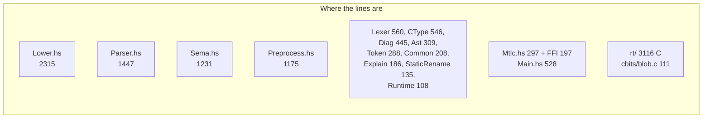

---

## 1. The shape of a run

`app/Main.hs` is the driver. It never stops at the first broken file: every
translation unit is preprocessed, lexed and parsed before anything gives up,
so one run reports everything that is wrong rather than turning one build into
five.

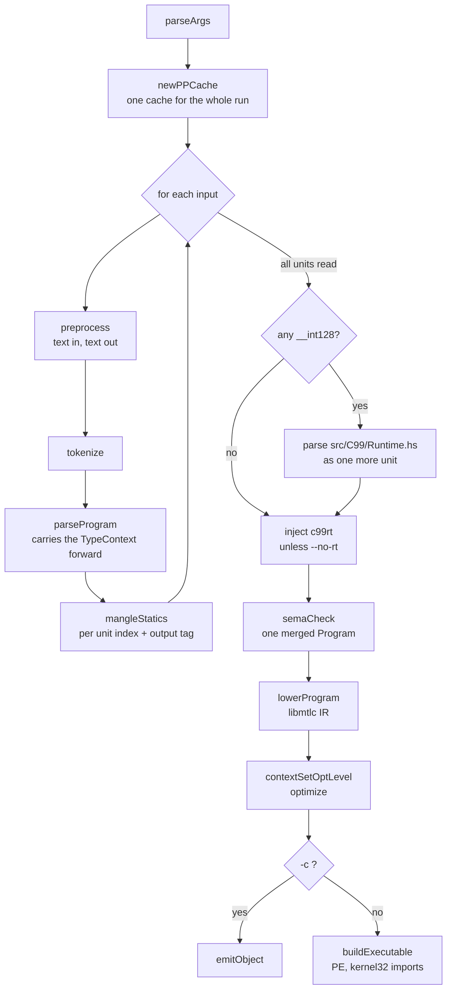

Two details in that picture matter more than they look.

**The TypeContext threads through every unit.** Struct layout lives in a
context keyed by `TagId`, not in the types themselves, so a `struct S` parsed
in unit 3 and one parsed in unit 7 have to agree. `foldMTU` carries the
context from one `parseTU` to the next, and the merged program is checked as
one.

**c99rt is injected as source, not linked as a library.** The driver adds the
thirteen files in `rt/` to the unit list, filtered so that a name the program
defines itself wins over the runtime's definition. That filter is what weak
linkage would do in a conventional toolchain, and it is why a program can
define its own `malloc` without a duplicate-symbol error.

### Symbol collisions across units and across runs

Two mechanisms keep names apart, and they solve different halves of the same
problem.

`mangleStatics prefix i` rewrites file-scope statics with the unit's index
within the run, so two units that both say `static int counter;` do not
collide when they merge.

That is not enough for separate compilation, because a second `c99mtlc -c`
invocation starts counting at zero again, and both objects would define
`__st0_counter` and `.str0_p`. So the prefix also carries `objectTag`, a
64-bit FNV-1a hash of the output path rendered in hex. Two runs writing
different objects get different tags; the same run is internally unique
already. The same tag reaches lowering as `srTag`, which names the globals it
invents for string literals.

Before that tag existed, two separately compiled objects silently kept one
definition of each colliding symbol.

---

## 2. The preprocessor

`src/C99/Preprocess.hs`, 1175 lines, text in and text out. The result is one
translation unit with `# n "file"` line markers so the lexer can attribute a
token to the header it came from.

### Lines, not characters

The input is a `ByteString`. `physLinesBS` slices it into physical lines that
are views into one buffer, never copies. Translation phases 1 and 2 (trigraphs
and backslash-newline splices) are skipped entirely when `needsPhase12` finds
no backslash and no `??` in the file, which is almost every file; a trailing
`\r` is sliced off per line, which is all the CRLF handling anything needs.

`ppLines` walks those lines with a fast path that is the whole performance
story: a line that opens no unbalanced `(` and names no macro cannot change
under expansion, so the original slice is emitted as-is. No unpack, no rebuild,
no repack. Only a line that might mean something to the macro engine pays for
`String` machinery. That is how 255,680 lines of SQLite preprocess in about
three seconds.

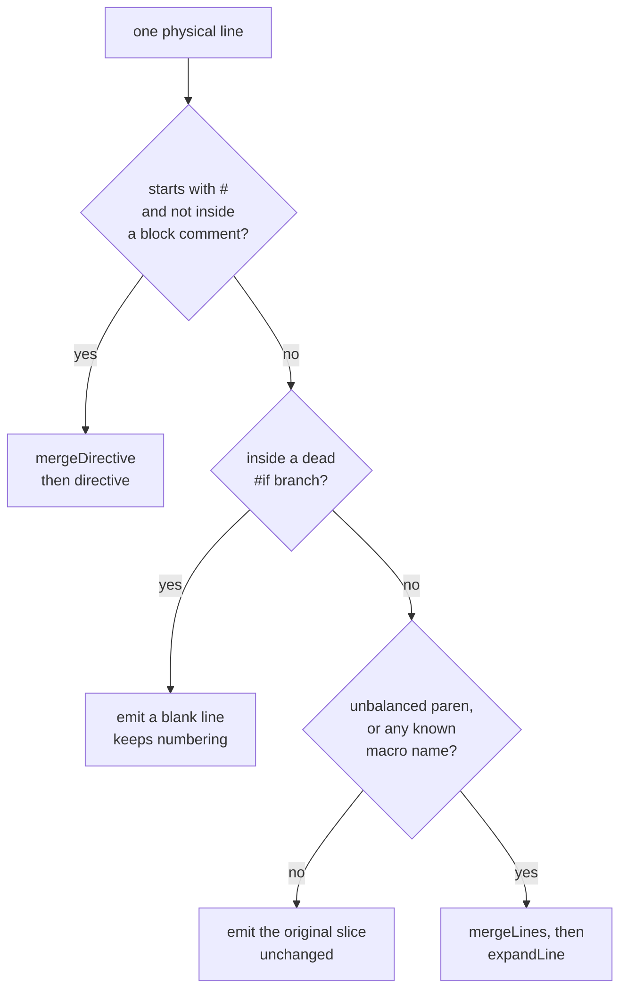

### A comment can carry a directive across a newline

C translation phase 3 replaces each comment with one space, and phase 4 only
then executes directives. So this is a single `#define`:

```c
#define A 1  /* a comment that
  ** wraps a line */
```

The preprocessor used to terminate the directive at the first physical
newline and treat the comment's tail as file-scope text. `mergeDirective`
absorbs following lines while `endsInComment` says the block is still open,
and the caller emits blank lines for what it swallowed so physical numbering
survives.

That single bug accounted for all 102 errors the SQLite amalgamation produced.

### Macro substitution is textual, so it has to defend the token boundary

`substMacro` splices argument text into body text. Nothing tokenizes, which
means two spliced pieces can lex as one token that neither side wrote:
`#define Q(A,B) A##B+` with `Q(+,)` must produce `+ +`, not `++`.

The accumulator is kept reversed so `##` can strip the whitespace it follows.
A boundary goes in wherever `fuses` says the last character of the left and
the first of the right would lex together: two identifier characters, a digit
against a dot, or two punctuators from `+-*/%<>=&|!^#.`. `##` is the only
thing that erases that boundary, so it sets a flag the next splice consumes.

Body punctuation is exempt. `->` written in a macro body is two characters the
author already meant to be adjacent; only a splice needs the check.

### Rescanning reaches past the replacement

C99 6.10.3.4p1 rescans a replacement together with the text that follows it,
which is what makes `CAT(A,B)(x)` call the macro the paste spelled.
`pendingCall` takes exactly that case and no more: the whole replacement is
one identifier, it names a function-like macro, it is not painted blue, and an
argument list is waiting. Anything wider risks re-expanding a macro that the
blue paint had already retired.

### `#if`

`ifCondition` runs the C99 6.10.1p4 order: strip comments, resolve `defined X`
before expansion can substitute into its operand, macro-expand what is left,
then evaluate. The evaluator is a plain recursive-descent chain from `eCond`
(the ternary) down through the binary levels to `ePrimary`, on `Int64`. An
identifier that survives expansion is 0, as the standard says.

### Command-line macros

`-D` and `-U` become `PPDef` values in command-line order and are applied over
the predefined table before the file is read. `-DF(x)=body` works because the
text is handed to `parseDefine`, the same function the `#define` directive
uses. There is no second parser for it.

---

## 3. The lexer

`src/C99/Lexer.hs`, 560 lines. Straightforward except in three places.

**Line markers.** The lexer resyncs on `# n "file"` lines the preprocessor
emitted, so a token's `SrcLoc` names the header it was written in rather than
an offset into the merged text.

**Wide literals.** `L` followed by `'` or `"` is a prefix on the literal, not
an identifier that happens to be one letter long. The lexer marks the token
`tokWide` and keeps the text exactly as written: the width of a `wchar_t` is
the type system's business, and decoding happens in sema.

**Character values.** A plain character literal is taken as an unsigned byte,
matching the C frontend this was ported from. A wide one keeps its whole code
point for sema to narrow.

---

## 4. The parser

`src/C99/Parser.hs`, 1447 lines of recursive descent over a token list in a
`State`. It carries the typedef table, because the C grammar is ambiguous
without it: `(T)*x` is a cast or a multiplication depending on whether `T`
names a type.

### Declarators are read inside out

This is the part of C's grammar that most implementations get subtly wrong,
and the one that took the most rewriting here.

A declarator modifies a base type from the inside out. In `int (*fp)(void)`,
the suffix `(void)` applies to `int` **first**, producing "function returning
int", and only then does `*fp` make a pointer of it.

The suffixes sit *after* the closing parenthesis, so they have to be read
before the declarator they belong to. The parser saves its cursor, skips the
balanced parens, reads the suffixes against the base type, saves the end
position, rewinds, parses the inner declarator with the suffix result as its
base, and jumps to the end. Every token is parsed exactly once.

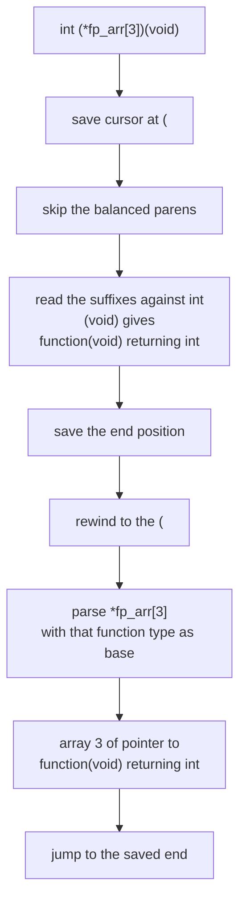

The older code counted how many pointer layers the inner declarator added and
re-applied that count on top of the suffixes. Pointer depth was the only thing
that crossed the paren boundary, so `int (*fp_arr[3])(void)` lost its array and
came out a bare function type. Carrying the whole type is what fixes it, along
with `int (*f(int))(int)`, `int (*(*pp)[3])(int, int)`, and `int (*q)[n]`,
whose VLA bound now reaches the declaration that owns it.

Parens that do **not** hold a declarator are a parameter list on a declarator
with no name, so `int f(int g(int), int)` parses too.

### Constant folding at parse time

`foldConst` folds an already-parsed expression to an integer: literals,
enumerators, unary and binary operators, the ternary, casts (narrowed through
`typeSize`), and `sizeof` applied to a **type name**. An array bound that folds
is a fixed array; one that does not is a VLA, and gets an id.

Enumerator values go through this same path. They used to go through a
separate integer-only constant parser that knew nothing of `sizeof`, which
rejected `A = sizeof(int) + FLAG` and with it every unity-based test suite.
That parallel parser is gone.

The remaining gap is `sizeof` applied to an **object**: the parser knows the
size of a type name but not of a name it has never typed, so
`int mix[sizeof(K)/sizeof(K[0])]` as a struct member stays incomplete.

### VLA bounds get ids here

An array bound that does not fold mints an id from a counter that is never
restored, and the `(id, expression)` pair is pushed onto the parser state.
`parseDeclaratorVla` brackets a declarator to collect them; a declarator nested
in parentheses calls `parseDeclaratorInner` instead, so its bounds reach the
same declaration rather than being dropped on the way out.

---

## 5. The type system

`src/C99/CType.hs`, 546 lines.

Struct, union and enum types are referenced by `TagId` into a `TypeContext`
rather than by structure. The C original this was ported from gives aggregates
identity by `Type*` pointer and completes a tag by mutating it in place;
Haskell values have no identity, so the table provides it, and nominal
equality falls out of comparing ids.

Because layout lives in the context, `typeSize` and `typeAlign` are functions
*of* the context rather than fields on the type.

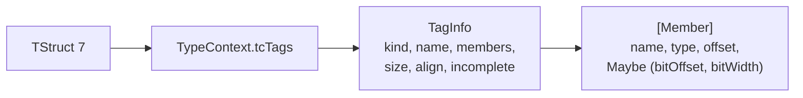

`tagDeclare` reuses an existing id for a named tag, which is what makes
`struct node *next;` inside `struct node` resolve to the same type.
`tagDeclareFresh` mints a new one for a definition that shadows an outer tag,
so `struct T { int y; }` in a block cannot overwrite the enclosing `struct T`
for types already built from it.

Bit-field packing follows the C frontend's rules: fields pack into 4-byte
units, a zero-width field closes the current unit, and a non-bit-field member
closes it too.

### Array kinds

`TArray Type Int ArrKind` where `ArrKind` is `AFixed`, `AVla id`, or `AStar`
for `[*]` in a prototype. The id is the link to the run-time bound, because a
type cannot hold an expression: types are what expressions are annotated
*with*, so the reference has to point the other way.

`typeIsVM` asks whether any bound in a type depends on a run-time value.
Everything that scales by a type consults it.

`typeEqual` deliberately ignores the array kind. Two variably modified types
are compatible when their bounds are equal, which is undecidable at compile
time, so comparing the ids would reject correct programs.

---

## 6. Semantic analysis

`src/C99/Sema.hs`, 1231 lines. In, a `Program` from the parser; out, a
`Program` in which every expression carries a type and every name resolves to a
`SymId`, plus the symbol table, the globals in declaration order, and the
diagnostics.

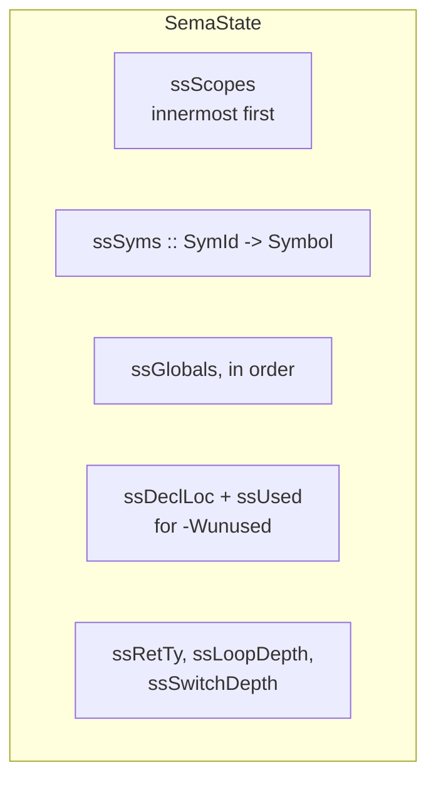

### Why symbols are ids

A reference to a symbol cannot be the symbol itself, because sema keeps
changing symbols after the reference is made. `&x` marks `x` address-taken
long after the walker left `x`'s declaration, and a definition later in the
file rewrites the type an earlier `extern` declaration gave it. An id is
stable; a copied value would be stale.

### File-scope declarations happen in two passes

A pre-pass walks the top level and inserts every function and object, so a call
to a function defined later in the file resolves. The main pass then checks
bodies. A block-scope declaration reuses the id the pre-pass assigned rather
than inserting again, which is why the redefinition check never fires against
the declaration's own second visit.

### Tentative definitions

At file scope, a declaration with no initializer and no `extern` is a tentative
definition (C99 6.9.2). It may be written as often as you like, and only a
second **initializer** is a redefinition. `Symbol` therefore records
`symIsDefined` (a definition exists, tentative or not) and `symHasInit`
separately, and `insertSymInit` rejects only the case where both the old and
the new declaration carry initializers.

The merged type is whichever declaration's type is *complete*, not whichever
came last, so `int late[]; int late[3] = {...};` gets the bound and
`extern int t[]; int t[5];` keeps it.

### `__int128` never reaches the backend

The parser desugars `unsigned __int128` into a two-`u64` struct and sema
rewrites its operators into calls. When any unit mentions it, the driver
compiles `src/C99/Runtime.hs`'s embedded source as one more translation unit to
supply the helpers.

### Diagnostics

`C99.Common.Message` carries a location, a length for the caret run, an error
code, an inline label, a help line, attached notes pointing at a second place
in the source, a warning group, and a name for the renderer to snap the caret
onto. Only the location and the text are required, so a pass can start plain
and get richer one call site at a time.

`C99.Diag` renders it: the snippet with a line or two of context, the caret
run, the label, the help, and each note as its own frame. Colour is decided by
`--color`, `NO_COLOR` and `CLICOLOR_FORCE`, and `--error-format=json` emits one
object per diagnostic for editors. `C99.Explain` holds the twelve error codes
that `--explain` can talk about.

Four warning groups exist: `unused`, `unreachable-code`, `missing-return`, and
`thread-local`. The rule for adding one is that it must fire; a flag that
silences nothing tells the user the compiler checks something it does not.

---

## 7. Lowering

`src/C99/Lower.hs`, 2315 lines, the largest module. It walks the checked
program and calls libmtlc's builder through `src/Mtlc.hs`.

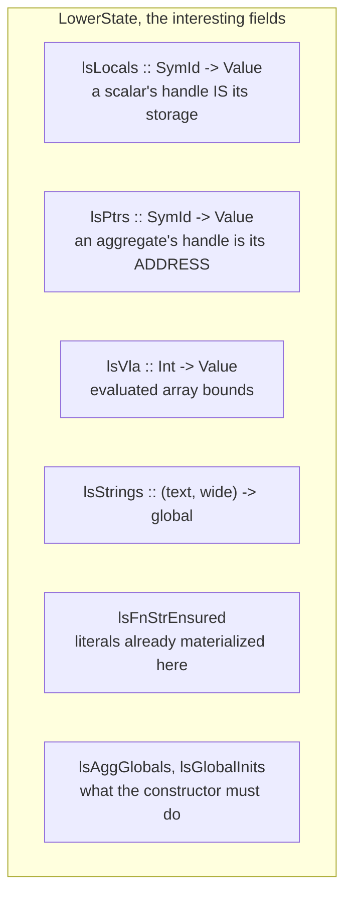

The `lsLocals` versus `lsPtrs` split is the single most load-bearing
distinction in the module. A scalar local's value handle *is* its storage, and
reading it yields the value. An aggregate local's handle holds the object's
**base address**, and reading it yields that address, never a load through it.
Every access path asks which map a symbol is in before deciding what a name
means.

### String literals

libmtlc's public builder cannot hand out a `char *` into `.data`, because
`mtlc_address_of` is defined only for locals and parameters. So a literal
becomes two things: the bytes packed into `u64` data globals, and a pointer
global that is filled in at run time by copying those bytes to the heap.

The copy is guarded by a null check on the pointer, so it happens once. The
guard has to run before any use, and **a function's entry block is the only
place that is true of**. Emitting it where the literal first appears puts it
inside whatever branch that was, and a use in a sibling branch then reads a
null pointer.

`stringsIn` walks a function body for every literal it mentions, and
`genFunction` materializes all of them before the body. Mettle's own diagnostic
renderer spells `"  --> %s:%zu:%zu"` in two arms of an `if`, and the arm that
came second crashed: 83 of that project's 647 tests, from one placement.

A wide literal is the same machinery with different bytes: `utf16Bytes` decodes
the source's UTF-8 to code points, re-encodes as UTF-16, and terminates with two
zero bytes. The intern key is the pair `(text, wide)`, so `"hello"` and
`L"hello"` are separate objects.

### Variably modified types

A row of `int a[n][m]` is `m * 4` bytes wide, and the type cannot say so. Each
non-folding bound has an id; the declaration that owns it carries the
expression; `bindVlaBounds` evaluates it once, where the declaration is, into a
hidden local; and `sizeOfV` computes a size from a type at run time.

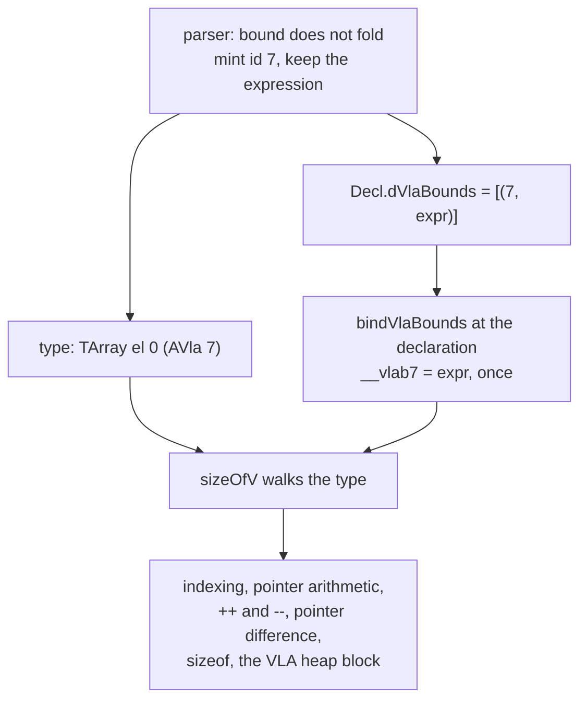

C says the type is fixed from the moment the declaration is reached, even if
the variables it named change afterwards, which is exactly what evaluating once
into a hidden local gives you. A parameter's bounds name earlier parameters, so
they are read on entry, in order.

A VLA local goes on the heap, because its size is not a frame offset the
prologue can reserve.

Two cases are refused rather than guessed at: `sizeof(int[n])` and a cast to a
variably modified type. A type name is not a declaration, so nothing evaluates
its bounds, and answering from a type that cannot know its own size would be a
silent wrong answer.

### Aggregates, calls and varargs

An aggregate return is an sret: the caller allocates, passes the storage as a
hidden first argument, and the callee fills it. A struct passed by value is
copied into the callee's own storage on entry, because the incoming pointer
names the caller's object.

A variadic call packs its trailing arguments into a stack buffer of 8-byte
slots: integers cast to `i64`, floats to `f64`. `__builtin_va_arg` walks it.
One convention, one buffer, no register-save area. It is also why an object we
compile cannot call a system libc's `printf`: the argument convention is ours,
not the platform's.

An indirect call builds a real function-pointer type for the callee before
calling through it. Without the signature the backend classifies every argument
as an integer and reads the result from RAX, so any float in or out came back 0.

### Compound literals and initializers

A compound literal's storage is a fresh stack slot, and C99 6.7.8p21 says a
member no initializer reaches is initialized as an object with static storage
duration, which means zero. The slot is cleared before the initializer runs.
Without that, `(T){0}` left every member past the first holding whatever the
frame last used it for. Mettle's IR lowering resets an instruction that way
between emits, and the stale operand pointer it kept crashed the compiler.

`char a[] = "text"` and `wchar_t w[] = L"text"` copy the literal into the array
rather than pointing at it, with the element width and the count taken from the
decoding.

### Globals and the constructor

A scalar global with a plain integer initializer rides along with the
declaration. Everything else needs code: a floating value, a pointer to a
string or an object, an aggregate, and any integer that is not a bare literal.
`-1` is a negation of `1`, not the integer `-1`, and reading it as a literal
silently started every negative global at zero.

Those declarations go into `lsGlobalInits` and are applied by
`__c99m_init_globals`, which `main` calls first.

An addressable global (an aggregate, or a scalar whose address is taken) is a
pointer global filled with a heap block, because `mtlc_address_of` does not
apply to globals. `ensureAggGlobal` emits the null-check guard at **every** use
rather than once per function, which is why it never had the string literal's
dominance bug.

### `volatile`

A volatile object is read from memory every time it is named and written every
time it is assigned, so it gets real storage rather than a value handle an
optimizer may keep in a register. The base goes in `lsPtrs`, which already
means "the storage is at this address", and `genIdent` loads through it because
the object is not an aggregate.

That memory is what carries a value across a `longjmp`, which restores every
register and touches nothing on the stack.

---

## 8. The backend binding

`src/Mtlc.hs` (297 lines) wraps `src/Mtlc/FFI.hs` (197 lines, 39 foreign
imports): `String` instead of `CString`, lists instead of pointer-and-count
pairs, `Maybe` instead of the `MTLC_NO_VALUE` sentinel. Lowering never touches
`Foreign.*`.

The surface is small: types (`tyScalar`, `tyPointer`, `tyBlob`, `tyFnPtr`), the
builder, values (`fnParam`, `constInt`, `constFloat`, `local`, `globalRef`),
instructions (`assign`, `binary`, `unary`, `call`, `callIndirect`, `cast`,
`addressOf`, `load`, `store`), control flow (`label`, `jump`, `branchIfZero`,
`ret`), and the context that optimizes and emits.

`cbits/blob.c` exists for one reason: `build.h` has no constructor for the
blob type, which is what a fixed-size chunk of stack storage needs.

To move to a newer backend: build MettleToolchain, run `vendor-libmtlc.sh` to
copy the headers and `mtlc.lib` into `libmtlc/`, then rebuild so `cbits`
recompiles against the new headers. The two must move together.

---

## 9. c99rt

Thirteen C files in `rt/`, written in C99 and compiled by c99mtlc itself as
part of every build. A finished program imports `kernel32.dll` and nothing
else, 49 functions.

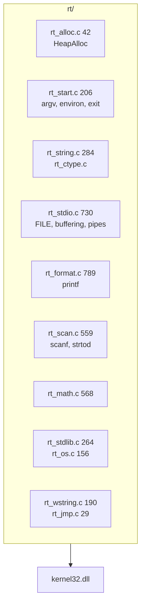

### Exact floating output

A `double` is `m * 2^e` with `m < 2^53`, so its decimal expansion is finite.
`rt_format.c` computes it with a bignum in base `10^9` limbs and rounds
half-to-even at the requested digit, which is what a correctly rounded CRT
prints. No table of powers, no guessing the last digit. The buffer is sized for
`2^1074` scaled by `10^17`: about 340 decimal digits either side.

`strtod` in `rt_scan.c` is the same machinery run backwards.

### Streams

One buffer per stream, with a direction flag saying whether it currently holds
pending writes or read-ahead; crossing over flushes or discards, so the file
position stays honest. `stderr` is unbuffered, and `stdout` picks line
buffering on a console and full buffering on a pipe, the policy every CRT uses.

### No CRT underneath

The mtlc startup object calls `__getmainargs` by msvcrt's signature before
`main`, so the runtime defines that symbol itself from `GetCommandLineA` plus
the MS quoting rules. Object symbols shadow DLL exports in the PE linker, so
merely defining it removes the msvcrt import. The environment comes from
`GetEnvironmentStringsA`, and `exit` is `ExitProcess` after flushing.

### Pipes

`_popen` runs a command through `%COMSPEC%` and hands back one end of a pipe.
The child must inherit its end and must **not** inherit ours, or it holds the
write end open and the reader never reaches end of file. `_pclose` waits and
reports the exit code. `fclose` reaps the child too, so a stream closed the
wrong way does not strand a process.

### setjmp

`RtlCaptureContext` fills a `CONTEXT` with its **caller's** registers and
resume point. That is the whole trick: `setjmp` is a macro (C99 7.13 allows
it), so the capture runs in the function that wrote `setjmp` and records that
function's own frame, still live when `longjmp` arrives from deeper down.
`RtlRestoreContext` resumes just after the capture, where the macro reads the
value `longjmp` left in the buffer.

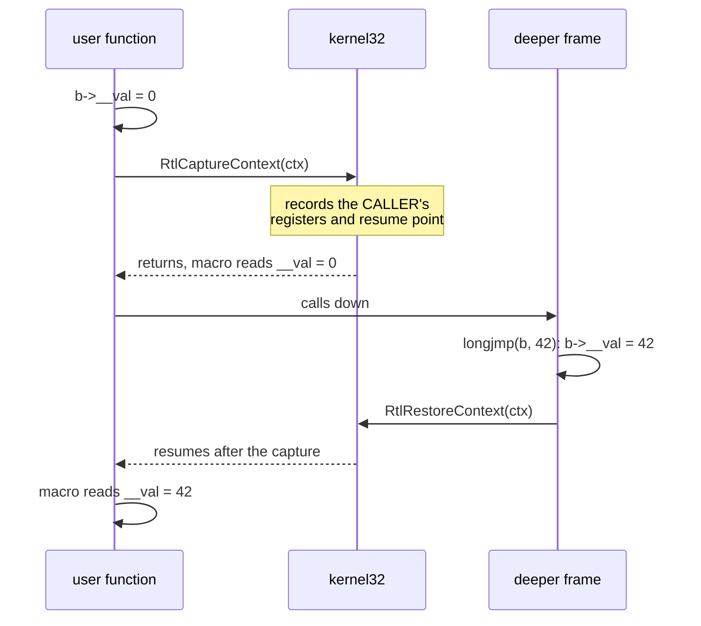

No assembly, and nothing in the runtime has to know which registers the ABI
calls callee-saved. A `CONTEXT` is 1232 bytes and needs 16-byte alignment, so
`jmp_buf` carries slack and `__c99m_jmp_ctx` rounds a pointer up inside it.

### Wide strings

`wchar_t` is 16 bits, as on every Windows toolchain, so `rt_wstring.c` is the
narrow routines over 16-bit units. Nothing there interprets a surrogate pair,
exactly as the C library does not.

---

## 10. Testing

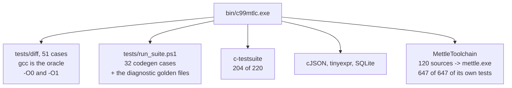

**The differential suite is the important one.** Each case is compiled twice,
by gcc and by c99mtlc, run both ways, and the output compared. gcc is the
oracle, so every case must be strictly conforming C99: no undefined behaviour,
no implementation-defined results, nothing that depends on a particular libc,
or gcc's answer is not authoritative and a disagreement proves nothing.

c99mtlc runs at both optimization levels, which separates two failure modes.
Both levels disagreeing with gcc is a frontend bug. The two levels disagreeing
with each other is a backend miscompile.

Every file in `tests/diff/` reproduces a bug that was live once, and several
work hard to be reproducible. `outparam_stack_residue.c` sprays 4KB of the
stack with `0xFF` before the call under test so the residue is there by
construction rather than by luck, and uses a function-pointer call to keep the
callee out of the inliner. `compound_literal_zero.c` dirties the frame the same
way.

**The self-host loop is the strongest single test.** c99mtlc compiles the
Mettle compiler's 120 C sources into a working `mettle.exe`, and that binary
runs the Mettle project's entire test suite. It is the only test that exercises
the compiler on a program complex enough to have its own optimizer, linker and
code generator.

### Diagnostics for debugging a miscompile

libmtlc honours two environment variables from inside c99mtlc, which is how an
optimizer miscompile gets bisected to a single pass in two runs:

- `METTLE_TRACE_IR_PASSES=1` prints every pass event with the function name.
- `METTLE_SKIP_PASS=<name>` disables passes by name or numeric id.

---

## 11. Known limits, and why each is where it is

- A struct member whose array bound is `sizeof` applied to an **object**
  stays incomplete and lands at offset 0. The parse-time folder knows the size
  of a type name but not of a name it has never typed. The fix is to keep
  member bound expressions and fold them in sema, where object types are known.
- `sizeof(int[n])` and casts to variably modified types are refused. A type
  name is not a declaration, so nothing evaluates its bounds.
- `__thread` parses and warns: libmtlc has no thread-local storage, so the
  object is an ordinary global shared by every thread. Right for a
  single-threaded program, wrong for any other, and said out loud rather than
  done quietly.
- Objects we compile use c99rt's varargs convention, so they cannot be linked
  against a system libc and call its `printf`. This also means a mixed-link
  bisect against gcc-built objects is not a debugging option.
- The driver cannot link `.o` files. `-c` produces objects that only an
  external linker can consume.
- SQLite's Win32 VFS does not build: `include/windows.h` is missing about
  thirty of the file APIs it calls. The amalgamation itself compiles clean with
  `-DSQLITE_OS_OTHER=1`.
